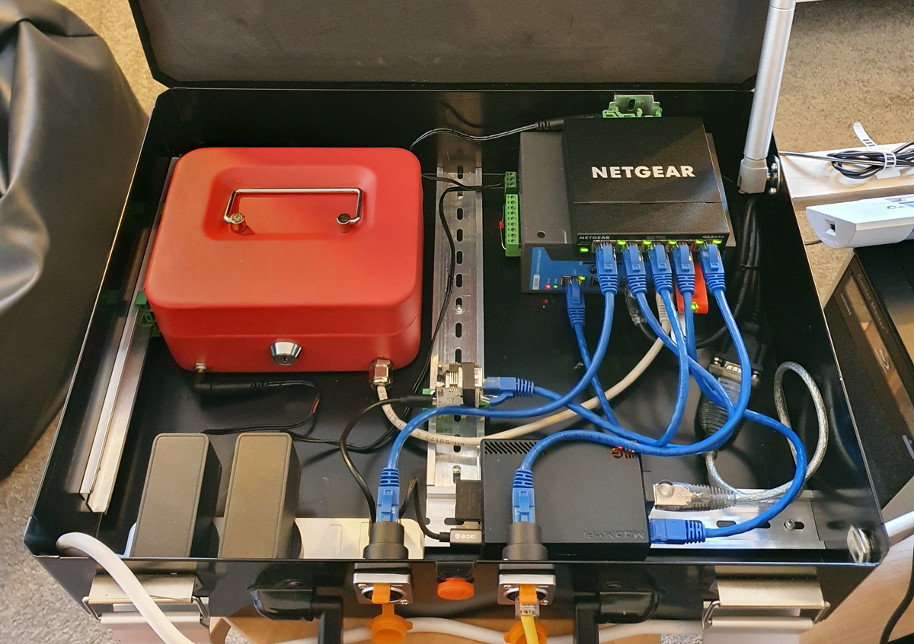

# IT/OT Hack lab (WIP!)

A sandboxed IT and OT hack lab.

This picture is from an earlier iteration which was more "IT" than "OT", but
I'm currently developing a new version with a model factory automation that
you can attempt to disrupt:

The hardware is:

 - Moxa IA240-LX with old (and vulnerable) firmware
 - NETGEAR ProSAFE GS105 Gigabit switch
 - Koyo CLICK Click C0-11DRE-D PLC
 - A (WIP) model factory automation

## Important note

This project is for my own enjoyment and to capture the flag events with
friends. It also relies on a real world automation I'll be building.

This is not a simple clone-and-build repository, so please understand I won't
be providing support for what is in here, I'm simply sharing it to benefit
anyone who might find it interesting or helpful for their project.

## Scenario

You goal is blow up a factory!

This is what we know:

 * There's a Moxa IA240-LX on the 192.168.0.0/16 network, with a
   Shellshock-vulnerable Apache instance.
 * There's a PLC on the network at 192.168.0.10.
 * The Moxa is supervising the a PLC in the control of the factory.

### Conditions

You cannot reboot anything.

### Reset

Reset the Moxa to factory settings, or at least reset the Moxa root password
to 'root'.

Run the `chaos_craig.sh` script to set up the random elements and start the
factory.
